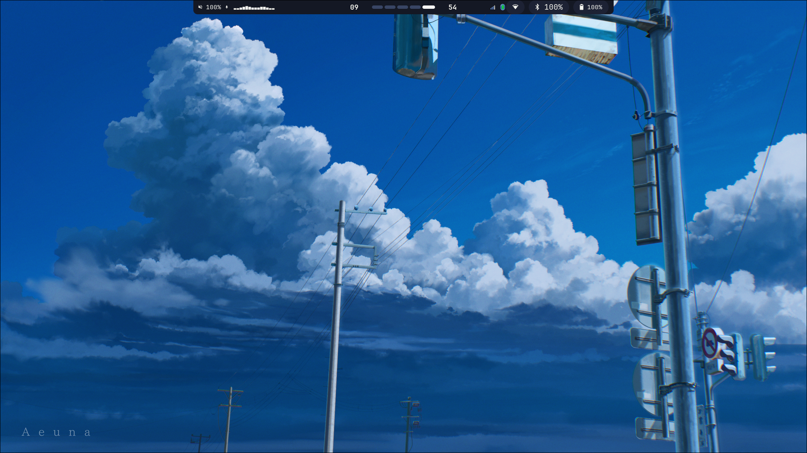
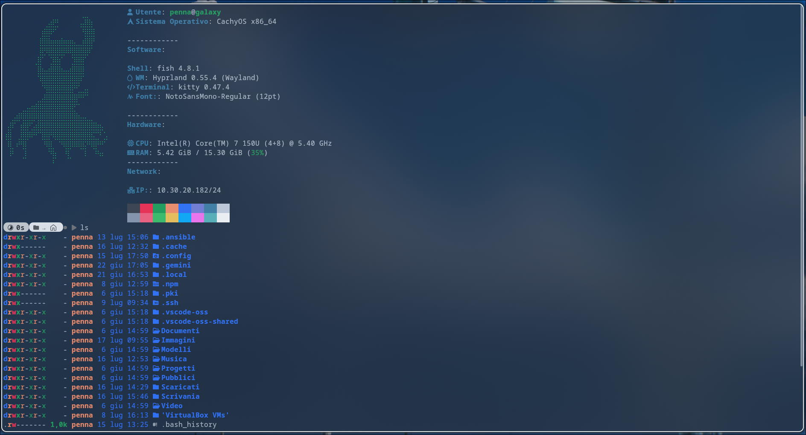
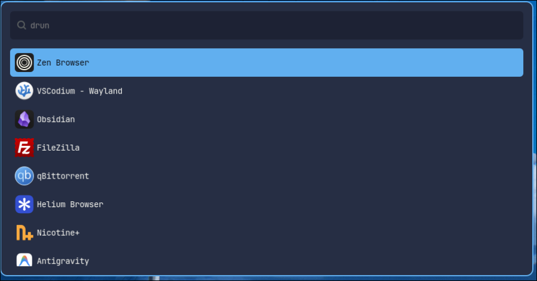
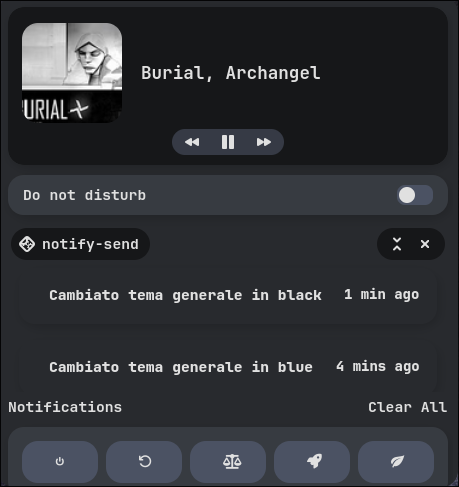
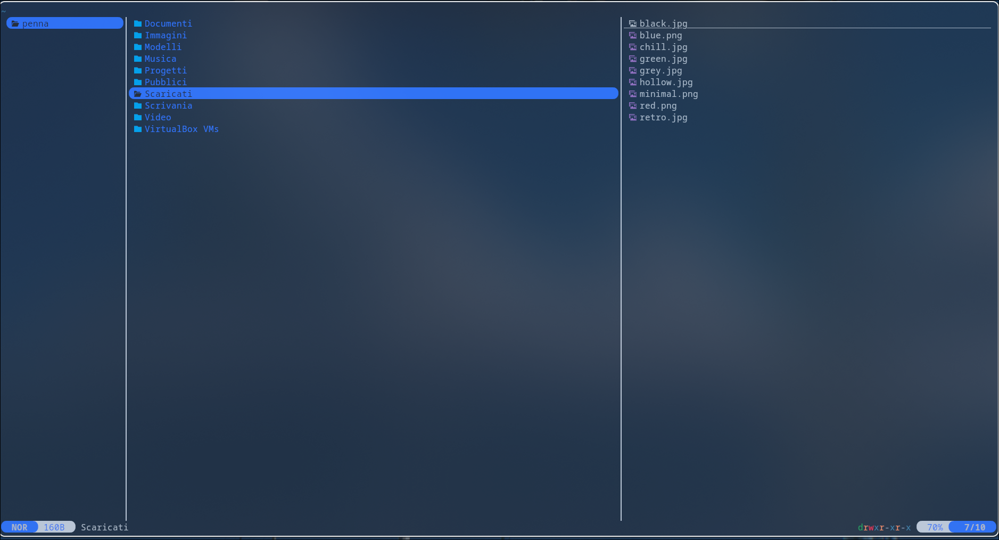
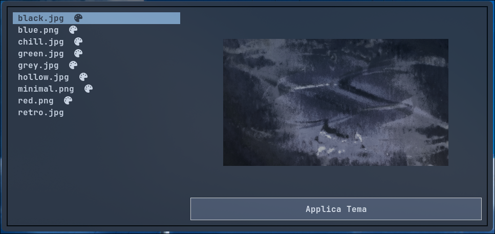

# **HYPRLAND NEWBIE DOTFILES**
> **In this Repo you will find my personal Dotfiles for my configuration of Hyprland and various other applications**

> ==**Disclaimer:**==
>Most of these configs were originally taken from other repos and then modified to my personal liking, the theme switchers (wp_switcher.sh & UI-switcher.py) were made completely by me.

---
# ***DE (Hyprland)***
>As mentioned before I use Hyprland and all the files are grouped under the .config/hypr/modules directory in order to make thing much easier and ordered.

>All things considered after the whole configuration it will loke something like this:

---
# ***Status Bar (Waybar)***
>No need to introduce Waybar.
>I followed a video from saneAspect and then changed it to my liking

>All together it should look like this:


---
# ***Terminal (Kitty)***
>I use kitty as my terminal emulator 'cause it's cooler coming from an honest alacritty config.

>I use the Bluloco dark theme for kitty which can be easily applied using this comand:

```kitty +kitten themes```

>How it's gonna look:


---
# ***App Launcher (Wofi)***
>Wofi is my app launcher, simple and fast.
>Not much to talk about here other than the possibility to execute CLI based application thanks to the binds.lua modules in hyprland and the config of wofi.

>How it's gonna look:


---
# ***Notification Center (Swaync)***
>I use Swaync as my notification center, clean adn easy.

>How it's gonna look:


---
# ***File explorer (yazi)***
>Yazi is super fast and terminal based.
>It gets a bit to get used to but once you try it you can never go back i'd say.

>Since it lives in the terminal it will get the same themee as that.



---
# ***Theme Switcher(awww with python/sh)***
>I coded (with some help) a theme switcher for all the previous apps bassed on the colors of the wallpaper in use.

>awww let's you change wallpaper blazingly fast by just a command (binded in hyprland config).

>The one written in Python (UI-switcher.py) lets you choose which theme to use
>You'll have to install some dependencies throgh pip!

>The one written in bash (wp_swticher.sh) is randomm each time 



---

# ***Final Video***


>I'am not a professional ricer, I just watch videos, read documentation and take notes
>Most of the explanation is already inside the files in Italian
>Have fun :D 
